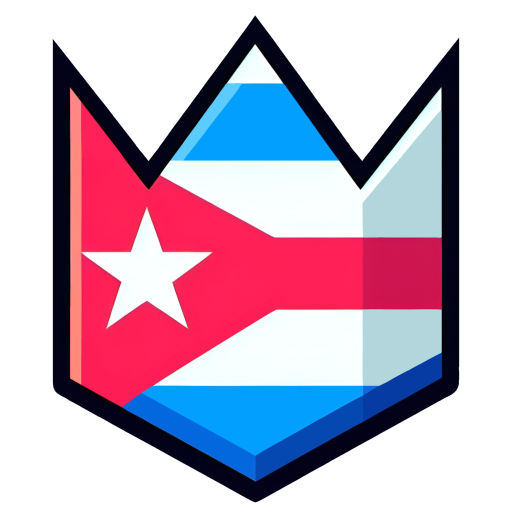

<div align="center">



# GD Cuba ΔΔΔ

Página Web de la comunidad cubana de Geometry Dash.  
Ranking, Cuentas y Records.

[gdcuba.vercel.app](https://gdcuba.vercel.app)
</div>

## Dependencias Principales

- React 18.2
- Next.js 14
- TailwindCSS
- PostgreSQL
- Vercel KV (Redis)

## Documentación Extra

```bash
yarn
yarn run docs
```

## Créditos

- GD Cuba Community
- [Alejandro Figueiras](https://github.com/Alejandro-Figueiras), Main Developer
- [Dayniel Martínez](https://github.com/SrDyw), Second Developer
- [Christian Mayan](https://www.youtube.com/@SrMichigunFuture), Logo and Trailers Designer
- Documentación de RobTop Endpoints desde [gd.docs](https://github.com/gd-programming/gd.docs)
